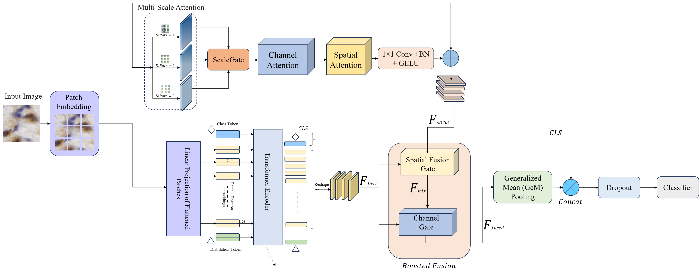

# Context-Aware DeiT + MCSA (Boosted)

> **F<sub>DeiT</sub> ⨁ F<sub>MCSA</sub> with spatial & channel fusion, GeM pooling, EMA+KD training, and full ROC reporting**



## TL;DR
We augment a DeiT backbone with a lightweight **M**ulti-scale **C**hannel- and **S**patial **A**ttention branch operating on the pre-transformer patch map. The transformer features **F<sub>DeiT</sub>** are fused with local features **F<sub>MCSA</sub>** using (i) a **spatial fusion gate** (per-location mixing) and (ii) a **per-channel gate**. The boosted training recipe adds **EMA**, **knowledge distillation**, and **TTA** at validation/testing. The pipeline saves confusion matrices, per-class metrics, and per-class ROC curves (CSV + PNG).

## Repo layout 

```
src/
  deit_csa/
    __init__.py
    models.py            # HybridDeiTParallel, HybridDeiTParallelBoosted, Local attention blocks
    train.py             # train/eval loops, boosted helpers (EMA, KD, TTA)
    data.py              # dataloaders & transforms
    metrics.py           # confusion matrix, per-class metrics
    roc.py               # ROC computation & saving
    utils.py             # seeding, CSV helpers, matplotlib check
scripts/
  run_ablation.py        # runs the selected ablations and writes results
docs/
  method.png             # the figure shown above
```


---

## Installation

```bash
conda create -n mihic1 python=3.10 -y
conda activate mihic1
pip install torch torchvision timm
# (optional) for plotting ROC curves:
pip install matplotlib
```

---

## Dataset

Expected folder layout (ImageFolder):

```
<DATASET_PATH>/
  train/<class>/*.png|jpg
  val/<class>/*.png|jpg
  test/<class>/*.png|jpg
```

Set the path in your config (or env var):

```python
DATASET_PATH = r"Path To Dataset"
```

---

## Usage

### 1) Run the boosted full CSA variant

```bash
python scripts/run_ablation.py   --deit_name deit_base_patch16_224   --epochs 15   --lr 1e-4   --wd 1e-4   --img_size_default 128   --boost_full True   --boost_full_img_size 224   --out_dir results_ablation
```

What this does:
- Builds loaders at 224 for the *boosted* model
- Trains with EMA + KD, TTA at eval
- Saves best checkpoint & full metrics/ROC under `results_ablation/DeiT_plus_multiscale_channel_spatial/`

### 2) Instantiate models directly

```python
from src.deit_csa.models import (
    make_deit_plus_multiscale_channel_spatial_boosted # boosted CSA
)


m_boost = make_deit_plus_multiscale_channel_spatial_boosted(num_classes=7, img_size=224)
```

---

## Key Components

- **Local Attention (MCSA)**
  - **Multi-scale** depth-wise 3×3 dilations {1,2,3} + **ScaleGate**
  - **ChannelAttention** (avg/max descriptors + 1×1 MLP)
  - **SpatialAttention** (multi-kernel over [avg,max], zero-init & centered residual)
  - 1×1 Conv + **BN** + **GELU**, residual with learnable scale

- **Fusion**
  - **SpatialFusionGate**: Conv(2C→h) → BN → ReLU → Conv(h→1) → Sigmoid
  - **Channel gate** α (sigmoid) blending **F<sub>DeiT</sub>** with *F<sub>mix</sub>*
  - **GeM** pooling (p learnable; stable on small grids)

- **Boosted Training**
  - **EMA** update each step; **KD** from EMA teacher to student
  - **Warmup**(20% epochs) → **Cosine** LR
  - **TTA**(flip) for validation/test logits

---


## Repro tips

- For **exact** numbers, keep the same:
  - `timm` version, DeiT weights, random seed (`42`)
  - Image sizes (128 base, **224 boosted**)
  - Batch sizes (train 512 / eval 256) & augmentations
  - Label smoothing (0.1 for boosted / 0.0 for others)

---

## Citation

If you use this repo, please cite: MIHIC-HybridNet: A Hybrid Vision Transformer
with Multiscale Channel–Spatial Attention for
Lung Cancer Detection

```bibtex
@misc{deit_mcsa_boosted,
  title={MIHIC-HybridNet: A Hybrid Vision Transformer
with Multiscale Channel–Spatial Attention for
Lung Cancer Detection},
  author={HUSSEIN M. A. MOHAMMED, ASLI NUR POLAT, and MUSTAFA EREN YILDIRIM},
  year={2025},
  url={[[https://github.com/yourname/deit-csa](https://github.com/AsHuTeam/MIHIC-HybridNet)]}
}
```

---

## License

MIT (see `LICENSE`).

---

### Notes

- We refer to the transformer features as **F<sub>DeiT</sub>** and the local branch features as **F<sub>MCSA</sub>** throughout the code and README for clarity.  
- No logic changes are required to match the paper figure; names are notational only.  
- If `matplotlib` is unavailable, ROC PNG is skipped but CSVs are still written.
